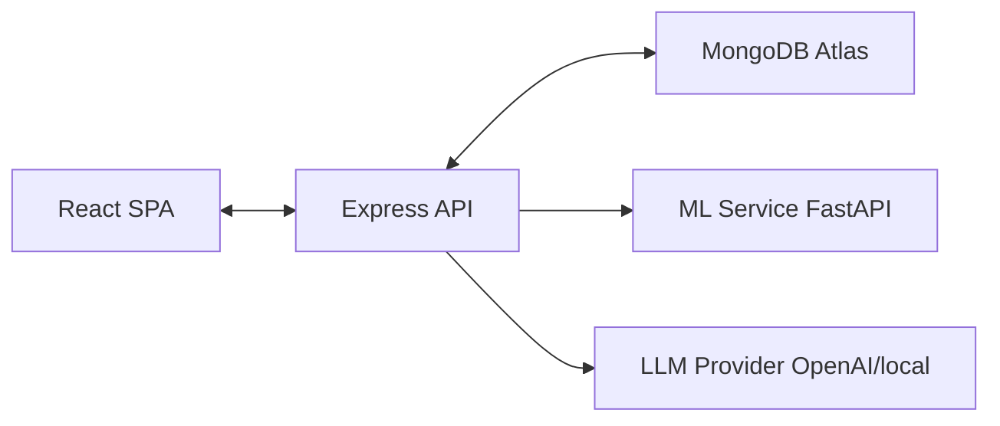

# 🚀 AlgoTrackr — A DSA Practice Tracker with AI Mentor

> **Track Smarter. Practice Better. Crack Faster.**

AlgoTrackr is an AI-powered DSA Practice Tracker and Mentor built with the **MERN stack** + **ML microservice**.
Designed for students preparing for placements — track problems, visualize progress, get AI recommendations and explanations.

## Table of Contents

- [Why AlgoTrackr?](#why-algotrackr)
- [Features](#features)
- [Tech Stack](#tech-stack)
- [Architecture Overview](#architecture-overview)
- [Getting Started](#getting-started)
- [Environment Variables](#environment-variables)
- [Project Structure](#project-structure)
- [Database Schemas (Example)](#database-schemas-example)
- [API Endpoints (Examples)](#api-endpoints-examples)
- [ML Service & LLM Integration](#ml-service--llm-integration)
- [Development & Testing](#development--testing)
- [Deployment Notes](#deployment-notes)
- [Roadmap & Future Enhancements](#roadmap--future-enhancements)
- [Contributing](#contributing)
- [License & Credits](#license--credits)
- [Contact](#contact)

---

## Why AlgoTrackr?

Many learners use lists, spreadsheets, or standalone coding sites but lack an integrated, analytics-driven study flow. AlgoTrackr combines:

- **Structured problem logging** (title, topic, difficulty, approach, time)
- **Topic-level & difficulty analytics**
- **Rule/ML-based recommendations** for what to solve next
- **LLM-powered explanations** of incorrect approaches
- **Placement-readiness scoring** and exportable analytics

This project is built using pure JavaScript and the MERN stack for simplicity and rapid development, perfect for developers focusing on full-stack logic and ML integration without complex DevOps overhead.

## Features

### MVP
- ✅ Email/password auth (JWT + Refresh tokens)
- ✅ Add / Edit / Delete problem entries
- ✅ Dashboard: topic breakdown, difficulty distribution, streaks
- ✅ Rule-based recommendation engine
- ✅ AI Explain endpoint (LLM proxy)
- ✅ Basic ML microservice stub (FastAPI)

### v1 / Future
- [ ] ML ranking model for personalized recommendations
- [ ] Offline training pipeline & scheduled retraining
- [ ] Exportable resume-ready analytics (PDF)
- [ ] Chrome extension, interview simulator, leaderboards, badges

## Tech Stack

### Frontend
- **React.js (JavaScript)**
- **Tailwind CSS**
- Recharts (charts)
- React Query / Axios

### Backend
- **Node.js + Express.js (JavaScript)**
- Mongoose (MongoDB)
- Zod (validation)
- JWT + bcrypt
- Helmet, rate-limiter, CORS

### ML / LLM
- **Python 3.10+, FastAPI**
- scikit-learn / LightGBM / pandas
- joblib for model persistence
- OpenAI (or local LLM) for explanations

### Tools
- MongoDB Atlas (Cloud Database)
- Postman (API Testing)
- Vercel / Render / Railway (Deployment)

## Architecture Overview



*Text representation:*
```
[React SPA]  <-->  [Express API]  <-->  [MongoDB Atlas]
                       |
                       +--> [ML Service (FastAPI)]
                       |
                       +--> [LLM Provider (OpenAI/local)]
```

- **Frontend** makes authenticated calls to Express.
- **Express** serves REST API, persists data into MongoDB, and calls ML/LLM microservices.
- **ML microservice** provides `/predict` endpoints for recommendations and can serve trained models.
- **LLM usage** is proxied through backend to hide API keys and rate-limit usage.

## Getting Started

These commands assume you have Node.js (>=16), npm, Python 3.10+, and pip installed.

### 1. Clone

```bash
git clone https://github.com/yourusername/algotrackr.git
cd algotrackr
```

### 2. Manual Setup & Run

Since we are not using Docker, you will run the backend, frontend, and ML service in separate terminal windows.

**Backend**
```bash
cd server
cp .env.example .env
npm install
npm run dev
# Server should be running on http://localhost:5000
```

**Frontend**
```bash
cd client
cp .env.example .env
npm install
npm start
# Client should be running on http://localhost:3000
```

**ML Service**
```bash
cd ml-service
python -m venv .venv
# Windows: .venv\Scripts\activate
source .venv/bin/activate
pip install -r requirements.txt
uvicorn app:app --reload --host 0.0.0.0 --port 8000
# ML Service running on http://localhost:8000
```

## Environment Variables

Create `.env` files for server and ml-service. Example keys:

**server/.env**
```env
PORT=5000
MONGO_URI=mongodb+srv://<user>:<pass>@cluster0.mongodb.net/algotrackr?retryWrites=true&w=majority
JWT_SECRET=supersecret_jwt_key
JWT_REFRESH_SECRET=another_refresh_secret
OPENAI_API_KEY=sk-...
ML_SERVICE_URL=http://localhost:8000
NODE_ENV=development
```

**ml-service/.env**
```env
ML_MODEL_PATH=/models/recommender.joblib
LOG_LEVEL=info
```

> **Note**: Do not commit `.env` to Git.

## Project Structure

```
algotrackr/
├── client/            # React frontend (JavaScript + Tailwind)
├── server/            # Express backend (JavaScript)
│   ├── src/
│   │   ├── controllers/
│   │   ├── routes/
│   │   ├── models/
│   │   ├── services/
│   │   ├── middleware/
│   │   └── server.js
│   └── package.json
├── ml-service/        # FastAPI ML microservice (Python)
└── README.md
```

## Database Schemas (Example)

These are example Mongoose payloads / JSON documents.

**users**
```json
{
  "_id": "ObjectId",
  "name": "Harsh Sharma",
  "email": "harsh@example.com",
  "passwordHash": "<bcrypt>",
  "role": "user",
  "meta": { "streak": 0, "totalSolved": 0 },
  "createdAt": "ISODate"
}
```

**problems**
```json
{
  "_id": "ObjectId",
  "userId": "ObjectId",
  "title": "Maximum Subarray",
  "platform": "leetcode",
  "link": "https://leetcode.com/problems/maximum-subarray/",
  "topics": ["arrays","kadane"],
  "difficulty": "easy",
  "timeTakenMins": 22,
  "solved": true,
  "approach": "I iterated and maintained running sum, but failed on negatives",
  "mistakes": "Edge case when all negatives",
  "meta": { "pattern": "kadane" },
  "createdAt": "ISODate"
}
```

**analytics (denormalized)**
```json
{
  "userId": "ObjectId",
  "topicStats": {
    "arrays": { "attempted": 20, "solved": 18, "avgTime": 23 },
    "dp": { "attempted": 8, "solved": 3, "avgTime": 50 }
  },
  "difficultyStats": { "easy": 50, "medium": 30, "hard": 20 },
  "placementScore": 68,
  "lastUpdated": "ISODate"
}
```

**ai_logs**
```json
{
  "userId": "ObjectId",
  "problemId": "ObjectId",
  "type": "explain",
  "payload": { "input": "...", "output": "..." },
  "createdAt": "ISODate"
}
```

> Use indexes on `users.email`, `problems.userId`, `problems.topics` for performance.

## API Endpoints (Examples)

All endpoints prefixed by `/api/v1`. Authentication uses `Authorization: Bearer <token>`.

### Auth
- `POST /api/v1/auth/register` - `{ name, email, password }`
- `POST /api/v1/auth/login` - `{ email, password } => { accessToken, refreshToken }`
- `POST /api/v1/auth/refresh` - `{ refreshToken } => new accessToken`

### Problems
- `GET  /api/v1/problems?topic=dp&difficulty=hard`
- `POST /api/v1/problems`
- `PUT  /api/v1/problems/:id`
- `DELETE /api/v1/problems/:id`

### Analytics
- `GET /api/v1/analytics/dashboard` - Response: `{ topicStats, difficultyStats, progress, placementScore }`

### AI
- `POST /api/v1/ai/recommend` - `{ userId } => { recommendations: [{problemId, title, reason, score}, ...] }`
- `POST /api/v1/ai/explain` - `{ problemTitle, approachText, code (optional) } => { explanation, suggestions }`

### ML
- `POST http://<ml-service>/predict` - `{ userFeatures } => { recommendations: [{problemId,score}, ...] }`

## ML Service & LLM Integration

### Strategy
- **MVP**: Rule-based recommender using analytics (determine weakest topic, suggest next difficulty).
- **v1**: Train a supervised model (RandomForest/LightGBM) to rank candidate problems by success probability.
- **LLM for “explain”**: Use OpenAI or a local LLM to produce human-friendly explanations of incorrect approaches.

### Example FastAPI predict endpoint

```python
# ml-service/app.py (FastAPI)
from fastapi import FastAPI
from pydantic import BaseModel

app = FastAPI()

class UserFeatures(BaseModel):
    user_id: str
    topic_accuracy: dict
    avg_time: dict

@app.post("/predict")
def predict(features: UserFeatures):
    # load model, compute ranking of candidate problems
    return {"recommendations": [{"problemId":"p123", "score":0.85}]}
```

### Important
- Do not call LLM directly from the frontend — proxy via backend to hide keys and rate-limit.
- Cache LLM / ML responses where useful.
- Store `ai_logs` for auditing, debugging and future training data.

## Development & Testing

### Testing
- **Backend / Frontend**: Jest + React Testing Library (optional)
- **ML**: pytest (optional)

### Format
- Prettier (recommended)
- `black` for Python (recommended)

## Deployment Notes

Since we aren't using containers, the easiest deployment strategy is platform-as-a-service (PaaS):

### Frontend
- **Vercel** or **Netlify**: Connect your GitHub repo, point to the `client` folder, and it will handle the build automatically.

### Backend & ML Service
- **Render** or **Railway**: Great for hosting Node.js and Python apps directly from GitHub.
- **Node.js Service**: Point to `server`, use start command `npm start`.
- **Python Service**: Point to `ml-service`, use start command for uvicorn.
- **Database**: Use managed **MongoDB Atlas**.

## Roadmap & Future Enhancements
- [ ] Improved ranking models (LightGBM/XGBoost)
- [ ] Knowledge graph of DSA concepts & dependencies for guided learning paths
- [ ] Chrome extension for auto import from platforms
- [ ] Interview simulator (timed sessions + scoring)
- [ ] Leaderboards, badges & community features
- [ ] Mobile app (React Native)

## Contributing
1. Fork the repo
2. Create a feature branch (`git checkout -b feat/awesome`)
3. Commit with clear messages
4. Push and open a Pull Request
5. Keep PRs small and focused

## License & Credits
- **MIT License**
- **Creator**: Harsh Sharma
- **Project name**: AlgoTrackr — DSA Practice Tracker with AI Mentor

## Contact
If you want help building this, want the starter repo scaffolded, or ML training notebook — ping me in the repo issues or contact: panditharshsharma34@gmail.com
